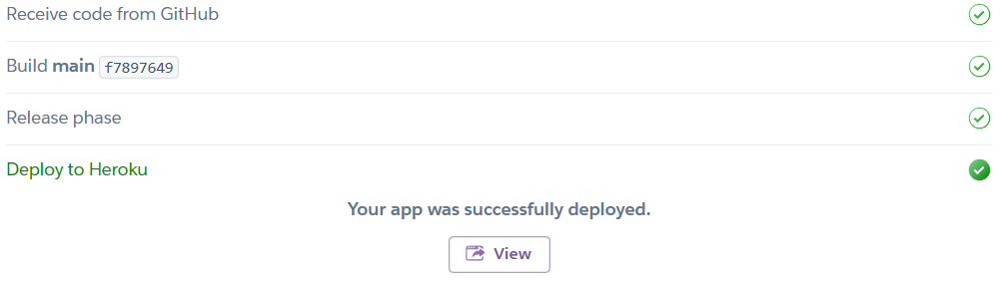

# Jot <!-- omit in toc -->
## A 5 minute journal app  <!-- omit in toc -->

[Testing Documentation](link)

[Live Site](https://jot-journal-2bfb14d7356f.herokuapp.com/)

 

# Table of contents <!-- omit in toc -->
- [1. Website Information](#1-website-information)
- [2. UX](#2-ux)
  - [2.1 Strategy](#21-strategy)
  - [2.2 Scope](#22-scope)
  - [2.3 Structure](#23-structure)
  - [2.4 Skeleton](#24-skeleton)
  - [2.5 Surface](#25-surface)
- [3. Technologies Used](#3-technologies-used)
- [4. Testing](#4-testing)
- [5. User Story](#5-user-story)
- [6. Deployment](#6-deployment)
  - [Heroku Deployment](#heroku-deployment)
- [7. Credits and Acknowledgments](#7-credits-and-acknowledgments)

## 1. Website Information 
Business goals: 
* Allow user to register for an account
* Allow user to log in to previously registered account
* Allow user to view previously posted entries
* Allow user to create a new book review entry
* Allow user to edit book review entries
* Allow user to delete a book review entry if they are logged in 
* Allow user to log out of account
* Allow user to access external social media pages

### 1.1 Website Sections: <!-- omit from toc -->
1. Home
2. Register 
3. Log in
4. Profile
5. Create Entry
6. Edit Entry

---

## 2. UX 

Whilst designing and creating this website I have taken into account the five planes of UX design, strategy, scope, structure, skeleton and surface.

### 2.1 Strategy
This plane is the first, it involves identifying the goals and objectives of the site and the user. By identifying these first, design decisions can be made that meet these goals.

**User and site goals**
Target users for Jot:
* Ages 13+ (I tried to style the web application in order to appeal to a broad age group)
* Gender non specific
* People who enjoy reading a wide variety of genres
* People who enjoy reviewing books they have read
* People who enjoy reading other's reviews of books

First time and returning user goals: 
* I want to register for an account.
* I want to log in and log out of my account.
* I want to be able to create new entries.
* I want to be able to find and read previous entries.
* I want to be able to edit previous entries.
* I want to be able to delete previous entries.
* I want to easiy and intuitively find my way around the site.

While the app is a book review platform, my goal was to create something that was incredibly simple but provided an enjoyable and aesthetically pleasing user experience with little to no guess work in regards to input and navigation features.

### 2.2 Scope
The second plane of UX looks at the **scope** of the website. What does the user have to do in order to reach both the user and the site owners goals for the website.

#### Features <!-- omit in toc -->

| Landing Page |A simple landing page navigating users to either register or log in to their accounts|
|:---:|---|
|`Nav Bar`|A responsive navigation bar that allows for easy navigation to every page of the site|
|`H1`|Used for the app name|
|`H2`|Used for the journal tagline|
|`Large Button`|A button navigating to the register page|
|`Large Button`|A button navigating to the log in page|
|`Small Button`|A button to sort entries by 'most recent'|
|`Small Button`|A button to sort entries by 'book title'|
|`Small Button`|A button to sort entries by 'author name'|
|`Footer`|A simple footer section with site creator info, a text link and social media links|

| Register |A page that allows the user to register for an account|
|:---:|---|
|`Nav Bar`|A responsive navigation bar that allows for easy navigation to every page of the site|
|`H3`|Used for the title of the page|
|`Form`|A simple form allowing users to input a username and password in order to register for an account|
|`Large Button`|A button to initiate registration|
|`Link`|A link to the log in page for users already registered|
|`Footer`|A simple footer section with site creator info, a text link and social media links|

| Log In |A page that allows the user to log in to their previously registered account|
|:---:|---|
|`Nav Bar`|A responsive navigation bar that allows for easy navigation to every page of the site|
|`H1`|Used for the title of the page|
|`Form`|A simple form allowing users to input their username and password in order to log in to their account|
|`Large Button`|A button to initiate log in|
|`Link`|A link to the register page for users not yet registered|
|`Footer`|A simple footer section with site creator info, a text link and social media links|

|Profile|A simple navigation page for users that have logged in|
|:---:|---|
|`Nav Bar`|A responsive navigation bar that allows for easy navigation to every page of the site|
|`H1`|Used for the title of the page (a user specific message generated on log in)|
|`Large Button`|A button navigating user to index page (home of all entries)|
|`Large Button`|A button navigating user to the create entry page|
|`Large Button`|A button logging user out and redirecting to log in page|
|`Footer`|A simple footer section with site creator info, a text link and social media links|

|Create entry|A form for users to fill in to create a new book review entry|
|:---:|---|
|`Nav Bar`|A responsive navigation bar that allows for easy navigation to every page of the site|
|`H3`|Used for the title of the page|
|`Form`|A form for users to fill in to create a new review entry| 
|`Large Button`|A submit button that saves new entry to database|
|`Footer`|A simple footer section with site creator info, a text link and social media links|

|Edit entry|A form for users to fill in to edit an existingbook review entry|
|:---:|---|
|`Nav Bar`|A responsive navigation bar that allows for easy navigation to every page of the site|
|`H3`|Used for the title of the page|
|`Form`|A form for users to fill in to create a new review entry| 
|`Large Button`|A cancel button that redirects user back to index page|
|`Large Button`|A submit button that saves edited entry to database|
|`Footer`|A simple footer section with site creator info, a text link and social media links|

|Log out|A function that allows user to log out of account|
|:---:|---|
|`Button` & `Nav Link`|Featured in both nav bar and on profile page, this does not load a page, just initiated a function that logs the session user out of their account and redirects user back to log in page|

|Flashes|A temporary message at the top of the page dependant on user interaction|
|:---:|---|
|`Flash Message`|When the user interacts with certain areas of the page a flash message is displayed at the top of the page. (i.e When the user successfully logs out a flash message appears saying 'You have been logged out') These messages lets the user know their desired action has been completed.|

### 2.3 Structure - Unfinished
The structure plane deals with the organising and arrangment of elements within the user interface. Creating userflows to define how the user will interact with the page. A big goal of the structure plane is to ensure that the users can easily find and access the information they need.

I created a userflow diagram to show how the user will interact with each page on the site. Since my goal was for the app to be simple I tried to keep each page and action within as few clicks as possible.

Click here for userflow

### 2.4 Skeleton
This plane is a more refined view of the user interface. Looking at the layout and visual hierarchy to ensure the site is both visually appealing and functional. I created a set of wireframes for different screen sizes, this is a simplified version of the final product, removing colour, typography, imagery to create a basic view of website and establish the layout.

| Mobile Wireframes | Desktop Wireframes |
|:---:|:---:|
|| |

*Note: Some areas have changed between the wireframes and the final product, this is either due to making the page easier to navigate or an added function later in development.*

### 2.5 Surface
The surface plane is the last layer and deals with the aesthetics of the user interface. This includes colour palettes, typography, graphics and visual style. The goal of this plane is to create a page that is visually pleasing and engaging for the user.

| Type | Image | Description|
|:---:|---|---|
|Typography - Title|| I chose to use a bold but readable font that gave the impression of being hand drawn, this fits with the idea of writing and journaling. I used this only for title text so that it visually differentiated the hierarchy of information on the page.|
|Typography - Main Text|| I chose to use a simple sans serif font for the rest of the text on the page, keeping the main bulk of the text in a simple, easy to read font keeps the design consistant and accessible.|
|Colours|| When deciding on a colour palette, I wanted to keep the web app as simple and readable as possible. By choosing a grey colour scheme with a red contrast colour I was able to achieve a higher level of contrast between background colours and text. From a development standpoint, I opted to use the built in class name colour palettes from Materialize CSS. This streamlined the styling stage of the project.|
|Colours|| For the buttons and clickable links I chose various shades of red from the Materialize CSS class name colour palette. By only having interactive parts of the page highlighted in red, the user can clearly identify these areas without having to guess.|

---

## 3. Technologies Used

### Languages <!-- omit in toc -->
[CSS](https://developer.mozilla.org/en-US/docs/Learn/Getting_started_with_the_web/CSS_basics) (Cascading Style Sheets) - allows developers to style HTML elements by defining properties such as colours, fonts and layout and enhances the user experience. It is also used to create responsivity.

[HTML](https://developer.mozilla.org/en-US/docs/Web/HTML) (HyperText Markup Language) - the standard markup language for creating web pages and applicatons. It provides structure for the content of the page and allows the developer to organise and define the elements (i.e headings, paragraphs, images and links).

[JavaScript](https://www.javascript.com/) - a programming language used to create interactive and dynamic web pages while executing in the web browser. Within this web app, I used JavaScript to initialise premade components from Materialize CSS (responsive and collapsable nav bar, calender date picker and a dropdown select box)  

[Markdown](https://www.markdownguide.org/) - designed to easily format text without complicated HTML. I used markdown to format and lay out both my README and TESTING documentation.

[Python](https://www.python.org/) - a versatile programming language known for its readability and simplicity. Encouraging clean and efficient code, it has a number of different applications from front end to back end. I have used Python to link the app to database as well as, depending on user interactions, executing a variety of functions (i.e register, log in, log out and all CRUD functions). 

### Frameworks & Libraries <!-- omit in toc -->
[Flask](https://flask.palletsprojects.com/en/3.0.x/) - a lightweight Python framework used in conjunction with Jinja templating in order to quickly and simply build and customise web applications. 

[jQuery](https://jquery.com/) - a fast and lightweight JavaScript libary used to simplify and streamline JavaScript code. It provides a set of easy to use built in functions that allow developers to manipulate HTML documents and handle events. I used jQuery to simplify the JavaScript code used to create interactivity and responsivity within the web app.

[Jinja](https://jinja.palletsprojects.com/en/3.1.x/) - a templating engine for Python, commonly used in development frameworks like Flask and Django. It allows the developer to seamlessly embed dynamic content within HTML allowing the use of variables, control structures and filters. I used Jinja to create HTML templates as well as iterate and display entries. I also used Jinja templating to show or hide certain aspects of the web app depending on if the user is logged in or not.

[Materialize CSS](https://materializecss.com/) - a front-end framework following Google's material design principles. It provides a collection of pre-designed components, styles and animations to simplify the building process. I used the responsive nav bar and footer components along with the pre-built buttons and form input fields. I also used Materialize CSS to style the web application.

### Design <!-- omit in toc -->
[Figma](https://www.figma.com/) - a design and prototyping tool used for UI/UX Design. I used figma to create responsive wireframes for each page of the web app.

[Google Fonts](https://fonts.google.com/) - a free, open-source collection of web fonts provided by Google. Using CSS I integrated and applied two of my selected fonts into the web app.

### Other <!-- omit in toc -->
[MongoDB](https://www.mongodb.com/) - a NoSQL database management system that stores data in a JSON-like format called BSON. It is designed to handle large volumes of unstructured or semi-structured data. I linked the database to the app in order to store user information and user input when executing CRUD functions.

[Heroku](https://www.heroku.com/home) - a cloud platform as a service (PaaS) that simplifies the deployment, management and scaling of web applications. Using Heroku I was able to connect both front and back end of my app and deploy the site successfully.

---

## 4. Testing
[Click to view testing documentation](testing.md)

---

## 5. Deployment
### GitHub pages deployment <!-- omit in toc -->
Once this is complete you should be able to view the webpage online, this is updated every so often which allows the user to see any changes in almost real time.

*Log in to GitHub*
- In your Repository section, select the project repository that you want to deploy
- In the menu located at the top of this section, click 'Settings'
- Select 'Pages' on the left-hand menu - this is around halfway down
- In the source section, select branch 'Master' and save
- The page is then given a site URL which you will see above the source section

### Heroku Deployment

**Creating an Application with Heroku**

I followed the below steps using the Code Institute Flask Walkthrough:

1. The following command in the Gitpod CLI will create the relevant files needed for Heroku to install your project dependencies `pip3 freeze --local > requirements.txt`.
2.  Please note this file should be added to a `.gitignore` file to prevent the file from being committed. 
3. A `Procfile` is also required that specifies the commands that are executed by the app on startup.
4. Go to Heroku.com and log in; if you do not already have an account then you will need to create one.
5. Select `Create New App`.
6. Enter a name for your new app, this needs to be a unique name (adding initials/your name at the end will help), you will be prompted if you need to change it.
Select the region you are working in.

**Heroku Deployment using website In the Deploy tab:**

*Connect your Heroku account to your Github Repository following these steps:*

1. Click on the `Deploy` tab and choose Github-Connect to Github.
2. Enter the GitHub repository name and click on `Search`.
3. Choose the correct repository for your application and click on `Connect`.
4. You can then choose to deploy the project manually or automatically, automatic deployment will generate a new application every time you push a change to Github, whereas manual deployment requires you to push the Deploy Branch button whenever you want a change made.

In the Settings tab, click on Reveal Config Vars and set the fo

|Deployment Type|Screenshot|Description
|:--:|:--:|:--:|
|Automatic||*In Heroku Settings*: You will need to set your Environment Variables within the config settings by clicking `Reveal Config Vars` before allowing automatic deployment - this is a key step to ensuring your application is deployed properly.|
|Manual||*In deploy tab*: You can also opt to manually deploy the project which will initiate a build.|

5. Once you have chosen your deployment method and have clicked `Deploy Branch` your application will be built and you should see the below `View` button, click this to open your application:

**Heroku CLI deployment** 

It's also possible to log in, commit and deploy your app via the command line:

1. Login to Heroku via the CLI using heroku login -i
2. Enter your email and password

3. Using the following commands in the terminal you can commit and push your files to both Heroku and Github:
    
    git add -A

    git commit -m "INSERT COMMIT MESSAGE"
    
    git push

---

## 6. Credits and Acknowledgments
[Am I Responsive?](https://ui.dev/amiresponsive) - Used to generate a screenshot of the web application on multiple viewport sizes.

[Figma](https://www.figma.com/) - Used to create wireframes.

[Font Awesome](https://fontawesome.com/) - Used to add icons to forms and for social media links in footer.

[Font-size Clamp Generator](https://clamp.font-size.app/?config=eyJyb290IjoiMTYiLCJtaW5XaWR0aCI6IjMyMHB4IiwibWF4V2lkdGgiOiIxMDI0cHgiLCJtaW5Gb250U2l6ZSI6IjI0cHgiLCJtYXhGb250U2l6ZSI6IjYwcHgifQ%3D%3D) - Used to create responsive text sizes.

[Google Fonts](https://fonts.google.com/) - Used to find fonts across the site.

[Materialize CSS](https://materializecss.com/) - Used to create fully responsive navbar and a variety of other components.

  
---