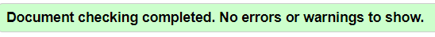

[Return to README](https://github.com/lrchnnng/parrot-quiz/blob/main/README.md)

---
# Testing <!-- omit in toc -->
- [Automated vs Manual Testing](#automated-vs-manual-testing)
- [Manual Testing](#manual-testing)
- [Automated Testing](#automated-testing)
- [Known bugs and fixes](#known-bugs-and-fixes)

---

## Automated vs Manual Testing

Automated testing and manual testing, when used in combination, are able to achieve a greater level of testing coverage. Automated testing is good for repetitive and critical tasks, while manual testing is good for new or changing requirements and exploratory testing.

---

## Manual Testing

---

Manual testing allows the tester to explore the site and using experience and creativity to find any issues within the site. It also takes into account flexibility and context, manual testing paramaters can be changed quickly depending on the requirements. The tester can also take into account the prospective users and their knowledge of the system in order to execute tests that are relevant.  

|Responsivity | Mobile S (320px)| Mobile L (425px)| Tablet (768px) | Desktop (1024px)|
|---|:---:|:---:|:---:|:---:|
|Responsive UI Components|✓|✓|✓|✓|
|Responsive Text|✓|✓|✓|✓|
|Responsive Form|✓|✓|✓|✓|
|Responsive Button Placement|✓|✓|✓|✓|
|Responsive Nav Bar|✓|✓|✓|✓|
|Responsive Footer|✓|✓|✓|✓|

|Nav Bar Testing|Yes/No|
|---|:---:|
|Nav bar text and styles are loaded|✓|
|Nav bar collapse appears up to medium sized screens|✓|
|Nav links work as intended|✓|
|Nav logo directs user to index page|✓|
|If user is **not** in session, nav bar shows `Home`, `Register` and `Log In` links|✓|
|If user is in session, nav bar shows `Home`, `Profile`, `Create Entry` and `Log Out` links|✓|
|`Home`link directs user to index page|✓|
|`Register` link directs user to Register page|✓|
|`Log In` link directs user to Log In page|✓|
|`Profile` link directs user to Profile page|✓|
|`Create Entry` link directs user to Creat Entry page|✓|
|`Log Out` link logs user out and redirects to Log In page and displays a flash message at top of page|✓|

|Footer Testing|Yes/No|
|---|:---:|
|Fonts and styling are loaded|✓|
|Logo directs user to index page|✓|
|`Instagram` link directs user to instagram site in a separate tab|✓|
|`Facebook` link directs user to facebook site in a separate tab|✓|
|`Pinterest` link directs user to pinterest site in a separate tab|✓|

|Index Page Testing|Yes/No|
|---|:---:|
|Font and styling are loaded|✓|
|Components are loaded|✓|
|`Register` button directs user to register page|✓|
|`Log In` button directs user to log in page|✓|
|`Sort by most recent` button sorts posts by most recent first|✓|
|`Sort by book title` button sorts posts by book title in alphabetical order|✓|
|`Sort by author` button sorts posts by author name in alphabetical order|✓|
|Sort buttons display as disabled once selected|✓|
|`Edit` button redirects user to the 'Edit Entry' Page|✓|
|`Delete` button deletes the post|✓|
|Flash message appears at top of page describing the sort order|✓|
|If user is **not** in session `Register` and `Log In` buttons are shown|✓|
|If user is in session only `Create Entry` button is shown|✓|
|If user is **not** in session, `Edit` and `Delete` buttons are **not** shown|✓|
|If user is in session, `Edit` and `Delete` buttons are shown|✓|

|Register Page Testing|Yes/No|
|---|:---:|
|Fonts and styles are loaded|✓|
|Username input does not accept under 5 characters|✓|
|Username input does not accept over 15 characters|✓|
|Username input does not accept special characters|✓|
|Password input does not accept under 5 characters|✓|
|Password input does not accept over 15 characters|✓|
|Password input does not accept special characters|✓|
|`Register` button directs user to profile page|✓|
|`Log In Here` link redirects user to Log In page|✓|
|Flash message appears at top of page confirming successful registration|✓|

|Log In Page Testing|Yes/No|
|---|:---:|
|Fonts and styles are loaded|✓|
|Username input does not accept under 5 characters|✓|
|Username input does not accept over 15 characters|✓|
|Username input does not accept special characters|✓|
|Password input does not accept under 5 characters|✓|
|Password input does not accept over 15 characters|✓|
|Password input does not accept special characters|✓|
|`Log In` button directs user to profile page|✓|
|`Register Here` link redirects user to Log In page|✓|

|Profile Page Testing|Yes/No|
|---|:---:|
|Fonts and styles are loaded|✓|
|Personalised message with session user username included|✓|
|`View Entries` button directs user to index page|✓|
|`Create Entry` button directs user to Create Entry page|✓|
|`Log Out` button logs user out and redirects user to log in page with a flash message at top of page confirming successful log out|✓|

|Create Entry Page Testing|Yes/No|
|---|:---:|
|Fonts and styles are loaded|✓|
|Icons are loaded|✓|
|`Review Title` input does not accept under 5 characters|✓|
|`Review Title` input does not accept over 50 characters|✓|
|`Book Title` input does not accept under 3 characters|✓|
|`Book Title` input does not accept over 100 characters|✓|
|`Author Name` input does not accept under 3 characters|✓|
|`Author Name` input does not accept over 50 characters|✓|
|`Book Genre` dropdown list is loaded|✓|
|`Book Genre` input displays genre once selected|✓|
|`Review` input does not accept under 5 characters|✓|
|`Review` input does not accept over 1000 characters|✓|
|`Publish Date` prompts a calendar selection|✓|
|`Publish Date` calendar text is all visible and easily readable|✓|
|`Publish Date` month dropdown selection functions correctly|✓|
|`Publish Date` year dropdown selection functions correctly|✓|
|`Publish Date` input displays selected date on form|✓|
|`Publisher Name` input does not accept under 3 characters|✓|
|`Publisher Name` input does not accept over 50 characters|✓|
|`Recommend Select Lever` functions correctly|✓|
|`Review Date` prompts a calendar selection|✓|
|`Review Date` calendar text is all visible and easily readable|✓|
|`Review Date` input displays selected date on form|✓|
|`Review Date` month dropdown selection functions correctly|✓|
|`Review Date` year dropdown selection functions correctly|✓|
|`Save Entry` button saves form content to MongoDB|✓|
|`Save Entry` button redirects user to index page|✓|
|Flash message appears at top of index page confirming successful creation of entry|✓|

|Edit Entry Page Testing|Yes/No|
|---|:---:|
|Fonts and styles are loaded|✓|
|Icons are loaded|✓|
|Previous input values are added to the form for user to change at will|✓|
|`Review Title` input does not accept under 5 characters|✓|
|`Review Title` input does not accept over 50 characters|✓|
|`Book Title` input does not accept under 3 characters|✓|
|`Book Title` input does not accept over 100 characters|✓|
|`Author Name` input does not accept under 3 characters|✓|
|`Author Name` input does not accept over 50 characters|✓|
|`Book Genre` dropdown list is loaded|✓|
|`Book Genre` input displays genre once selected|✓|
|`Review` input does not accept under 5 characters|✓|
|`Review` input does not accept over 1000 characters|✓|
|`Publish Date` prompts a calendar selection|✓|
|`Publish Date` calendar text is all visible and easily readable|✓|
|`Publish Date` month dropdown selection functions correctly|✓|
|`Publish Date` year dropdown selection functions correctly|✓|
|`Publish Date` input displays selected date on form|✓|
|`Publisher Name` input does not accept under 3 characters|✓|
|`Publisher Name` input does not accept over 50 characters|✓|
|`Recommend Select Lever` functions correctly|✓|
|`Review Date` prompts a calendar selection|✓|
|`Review Date` calendar text is all visible and easily readable|✓|
|`Review Date` input displays selected date on form|✓|
|`Review Date` month dropdown selection functions correctly|✓|
|`Review Date` year dropdown selection functions correctly|✓|
|`Cancel` button redirects user back to index without saving changes|✓|
|`Edit Entry` button saves form content to MongoDB, rewriting previous entry|✓|
|`Save Entry` button redirects user to index page|✓|
|Flash message appears at top of index page confirming successful edit of entry|✓|

## User Story
1. I want to register for an account.

2. I want to log in and log out of my account.

3. I want to be able to create new entries.

4. I want to be able to find and read previous entries.

5. I want to be able to edit previous entries.

6. I want to be able to delete previous entries.

7. I want to easiy and intuitively find my way around the site.
  
  |Name|Screenshot|
  |:---:|:---:|
  |Name||

---

## Automated Testing

Automated tests are repeatable and reliable as there is limited risk for human error. It allows for testing on both a small and a large scale in a quick and efficient manner. Automated testing might be used to test the performance of a site in order to ensure that it can handle page loading.

### HTML and CSS Validation <!-- omit in toc -->
### HTML <!-- omit in toc -->
[HTML Validation](https://validator.w3.org/nu/#textarea)
|Page|Errors|Explanation|Fixes|
|:---:|---|---|---|
|All pages but Base|Warning for missing `lang` attribute|A suggestion of the addition of `lang` attribute to declare the language of the document. Since I am using Jinja templating to extend the base template which includes this attribute this does not need to be included in the other pages|Warning Ignored|
|All pages|Bad Value, Parse Error & Text not allowed Error|The validator does not recognise the curly brackets used in the Jinja statements. Ignoring all of the errors that include the use of curly brackets there are no other issues.|Errors ignored|
|Index|Stray end tag `div`|An extra unused div tag found on line 24|Removed the stray div tag|
|Create Entry|Attribute `type` not allowed on element **textarea**|Using `type="textarea"` is not allowed on a textarea element|Type attribute removed|
|Edit Entry|Attribute `type` not allowed on element **textarea**|Using `type="textarea"` is not allowed on a textarea element|Type attribute removed|
|Log In|Unclosed element `div`|An unclosed div element found on line 35|Added missing closing `div` element|

### CSS <!-- omit in toc -->
[CSS Validation](https://validator.w3.org/nu/#textarea)

All pages passed CSS validation

### Lighthouse <!-- omit in toc -->

| Page | Test Results | Lighthouse Suggested Improvements |
|:---:|---|---|
|Index - Test 1||Edit and delete buttons have no discernable name, I have fixed this by adding aria labels to the buttons in order to assist screen readers|
|Index - Test 2||Future goals: Create a custom 'disabled button' class style with higher contrast for the disabled sort button. Enable text compression and defer all non-critical JS and styles in order to stop resources from blocking the render.|
|---|---|---|
|Register - Test 1||Future goals: Reduce unused JavaScript from MaterializeCSS|
|---|---|---|
|Log In - Test 1||Future goals: Reduce unused JavaScript from MaterializeCSS|
|---|---|---|
|Profile - Test 1||Future goals: Defer all non-critical JS and styles in order to stop resources from blocking the render lowering the time it takes to load the page.|
|---|---|---|
|Create Entry - Test 1||Issues with contrast between background and foreground, I have changed the 'Choose Genre' dropdown font colour, and the font colour of the switch lever labels|
|Create Entry - Test 2||Future goals: Remove unused JavaScript and reduce initial server response time. I would also find a way to add a label to the dropdown genre menu to improve accessability score.|
|---|---|---|
|Edit Entry|||
   
## JavaScript Testing <!-- omit in toc -->
* I also ran both JS files through JSHint to make sure it was thoroughly tested.
 
* Throughout development I used console logs to test that the functions worked as intended.
 

## Known bugs and fixes 
- **Issue**: connecting MongoDB
  - **Solution**: adding in DB name to connection URL in env.py
-**Issue**: white text not showing on date picker
  -**Solution**: changed background colour of datepicker

## Testing Credits
- [JShint](https://jshint.com/)
  * Used for testing.
- [Lighthouse](https://developer.chrome.com/docs/lighthouse/overview/)
  * Used for testing.